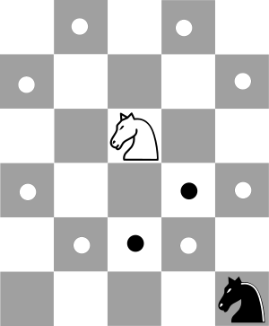

# Konj na šahovnici

```@meta
CurrentModule = NumMat
DocTestSetup  = quote
    using NumMat
end
```

Konj naključno skače po šahovnici. Katera polja bolj pogosto obišče?

Kaj pa če po šahovnici skačeta 2 konja? Prej ali slej bo en konj pojedel
drugega. Na katerih poljih se bo to najverjetneje zgodilo?



*Možne poteze konja*

## Markovske verige

Problem modeliramo z [markovskimi verigami](https://en.wikipedia.org/wiki/Markov_chain). 
Prostor stanj markovske verige je v primeru enega konja polje na šahovnici, v primeru dveh konjev pa par
šahovskih polj. Markovsko verigo predstavimo [konjevim grafom](https://en.wikipedia.org/wiki/Knight%27s_graph), 
ki povezuje dve polji, če lahko konj skoči z enega na drugega. Če predpostavimo, da konj
skoči na vsako dostopno polje z enako verjetnostjo, dobimo markovsko verigo.
Verjetnosti za prehod med stanji predstavimo z matriko prehodnih verjetnosti:

```math
P = [p_{kl}]_{k,l} = P(\text{iz stanja k preide v stanje l})
```

Za primer konja na šahovnici lahko stanje označimo s pari števil `(i,j)`, ki označujejo polje na šahovnici, kjer je konj trenutno postavljen. V prehodni matriki smo predpostavili, da je stanje označeno z enim samim številom, zato moramo dvojni indeks `(i,j)` preslikati v zaporedna števila. To lahko storimo, tako da polja številčimo po stolpcih. Če je šahovsko polje velikosti $m\times n$, dobimo naslednjo preslikavo med indeksi:

```math
\begin{matrix}
(1,1)\to 1 & (1, 2)\to m+1 &\ldots & (1,m)\to 1+m(n-1)\\
(2,1)\to 2 & (2, 2)\to m+2 &\ldots & (2,m)\to 2+m(n-1)\\
\vdots     & \vdots        &\vdots &\vdots \\
(m,1)\to m & (m,2)\to 2m   &\ldots & (m,n)\to mn
\end{matrix}
```

in zaporedni indeks posameznega polja lahko izrazimo s formulo:

```math
k = i + (j-1)*m
```

Poglejmo si polje velikosti 3 krat 3. Število stanj je 9  Polja so razvrščena v naslednjem vrstnem redu

```math
(1,1), (2,1), (3, 1), (1,2), (2, 2), (3, 2), (1, 3), (2, 3), (3, 3)
```

Prehodna matrika je dimenzije $9\times 9$.

```julia-repl
julia> using NumMat
julia> P = prehodna_matrika_konj(3, 3)
julia> Matrix(P)
9×9 Array{Float64,2}:
 0.0  0.0  0.0  0.0  0.0  0.5  0.0  0.5  0.0
 0.0  0.0  0.0  0.0  0.0  0.0  0.5  0.0  0.5
 0.0  0.0  0.0  0.5  0.0  0.0  0.0  0.5  0.0
 0.0  0.0  0.5  0.0  0.0  0.0  0.0  0.0  0.5
 0.0  0.0  0.0  0.0  0.0  0.0  0.0  0.0  0.0
 0.5  0.0  0.0  0.0  0.0  0.0  0.5  0.0  0.0
 0.0  0.5  0.0  0.0  0.0  0.5  0.0  0.0  0.0
 0.5  0.0  0.5  0.0  0.0  0.0  0.0  0.0  0.0
 0.0  0.5  0.0  0.5  0.0  0.0  0.0  0.0  0.0
```

Iz vsakega polja razen iz sredine lahko konj skoči le v dve polji, zato so prehodne verjetnosti enake `0.5`.
Kot primer vzemimo $p_{1,6} = 0.5$, kar pomeni, da iz polja $(1,1)$ konj z verjetnostjo $0.5$ skoči na polje
$(3, 2)$. V tem primeru je prehodna matrika simetrična, a to nikakor ni praivlo.

## Limitna porazdelitev Markovske verige

Limitna porazdelitev Markovske verige je lastni vektor transponirane matrike
prehodnih verjetnosti $P$ za lastno vrednost 1.

```math
P\vec{p}=\vec{p}
```

Da se pokazati, da je 1 največja lastna vrednost prehodne matrike za markovsko verigo, zato lahko za izračun lastnega vektorja
uporabimo potenčno metodo. 

!!! note "Potenčna metoda"

    S [potenčno metodo](https://en.wikipedia.org/wiki/Power_iteration) zgradimo zaporedje približkov, tako da prejšnji približek 
    $x^{(n)}$ pomnožimo z matriko $A$ in dobljeni rezultat normiramo:
    ```math
    x^{(n+1)} = \frac{Ax^{(n)}}{\|Ax^{(n)}\|}
    ```
    Običajno uporabimo maksimalno normo, saj jo je mogoče najhitreje izračunati. Namesto norme lahko uporabimo tudi katerokoli neničelno komponento približka. Približek za lastno vrednost $\lambda$ lahko izračunamo z [Rayleighovim kvocientom](https://en.wikipedia.org/wiki/Rayleigh_quotient)
    ```math
    \lambda=\frac{x^TAx}{x^Tx} = x^TAx
    ```
    Če smo uporabili za normiranje uporabili $k$-to komponento vektorja, pa lahko približek za lastno vrednost izračunamo
    kar kot kvocient $(Ax)_k/x_k$.

## Premik

Če poskusimo potenčno metodo za primer konja na šahovnici, ugotovimo, da metoda ne konvergira.

```julia-repl
julia> using NumMat
julia> using Random; Random.seed(321);
julia> P = prehodna_matrika_konj(8, 8);
julia> λ, v, it = potencna(P', rand(64); maxit=10000, tol=1e-2)
ERROR: Potenčna metoda ne konvergira
```

Razlog se skriva v lastnosti [konjevega grafa](https://en.wikipedia.org/wiki/Knight%27s_graph), ki je [dvodelen](https://sl.wikipedia.org/wiki/Dvodelni_graf). Zato ima prehodna matrika tudi lastno vrednost -1. Približki potenčne metode tako skačejo med
dvema vektorjema

```math
\alpha v_1 + \beta v_2 \text{ in } \alpha v_1 - \beta v_2,
```

kjer je $v_1$ lastni vektor za $1$ in $v_2$ lastni vektro za $-1$. 

Nastali problem lahko rešimo s premikom

!!! note "Premik lastnih vrednosti"

    Če matriki $A$ prištejemo večkratnik identične matrike $\sigma I$, se bodo
    lastne vrednosti premaknile za $\sigma$, lastni vektorji pa bodo ostali enaki.
    Namestno, da iščemo lastne vektorje matrike $A$, je včasih bolje poiskati
    lastne vektorje premaknjene matrike
    ```math
    A+\sigma I
    ```
    Še posebej je to uporabno pri [inverzni iteraciji](https://en.wikipedia.org/wiki/Inverse_iteration), kjer s
    lastni vektor za poljubno lastno vrednost. 

Če prehodno matriko premaknemo za $I$, se bodo lastne vrednosti premaknile tako, da se bo lastna vrednost 1
premaknila v 2, lastna vrednost -1 pa v 0. Potenčna metoda bo potem konvergirala k invariantni porazdelitvi.

```@example
using NumMat
import LinearAlgebra.I
import Random.seed!;
seed!(321);
P = prehodna_matrika_konj(8, 8);
λ, v, it = potencna(P'+I, rand(64))
using Plots
heatmap(reshape(v/sum(v), 8, 8))
savefig("invariantna_porazdelitev_konj.png")
```


*Invariantna porazdelitev za slučajni sprehod konja na standardni šahovnici*

## Naloga

Določi invariantno porazdelitev za dva konja. Na katerem polju bo en konj najverjetneje pojedel drugega?

## Povprečni čas do konca igre

Recimo, da na šahovnici naključno skačeta dva konja. Igra se konča, ko en konj poje drugega (pride na isto polje kot drugi). Zanima nas, koliko je povprečni čas, da se to zgodi. Pomagamo si lahko z matriko prehodnih verjetnosti. Matriko prehodnih verjetnosti lahko zapišemo v kanonični bločni obliki

```math
P = \begin{bmatrix}Q & R\cr 0& I\end{bmatrix}
```

kjer sta $Q$ in $R$ neničelni matriki, $I$ je identiteta in $0$ ničelna matrika ustreznih dimenzij. 

```math
(I-Q)^{-1}\cdot \mathbf{1},
```

kjer je $\mathbf{1}=[1, 1,\ldots 1]^T$ vektor samih enic.

## Koda

```@index
Pages = ["06_konj.md"]
```

```@autodocs
Modules = [NumMat, Base]
Pages = ["potencna.jl", "konj.jl"]
Order   = [:function, :type]
```